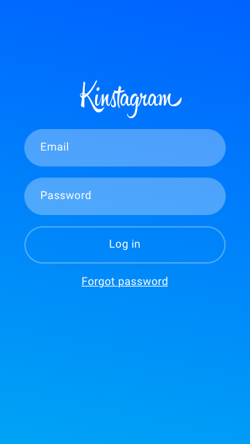

# Kinstrgam

Our idea is integrating Kin into photo and video social sharing app. Friends and followers can show their appreciations by sending real Kin for photos they love. This way users can earn kin for what is now an integral part of our digital life.
In addition the top earning photo and video will get daily/weekly or monthly award. This is a seamless way to earn and spend kin. In the hackathon we build a very basic Proof of concept. Users can upload photos or take picture and also send kin to photo they like. Building a full scale photo sharing app require many features and we intend to continue and improving the POC further.

### Splash screen 

### Login screen 

### Profile screen 

### Feed screen 

### Give Kin screen 

